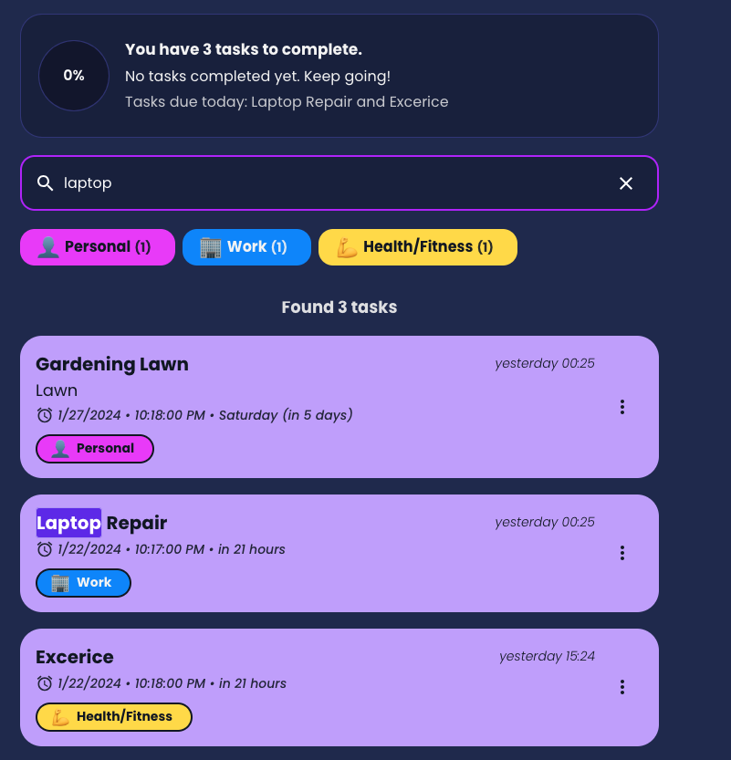
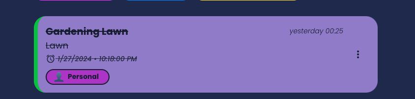
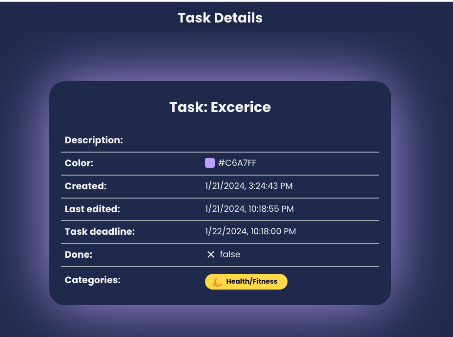
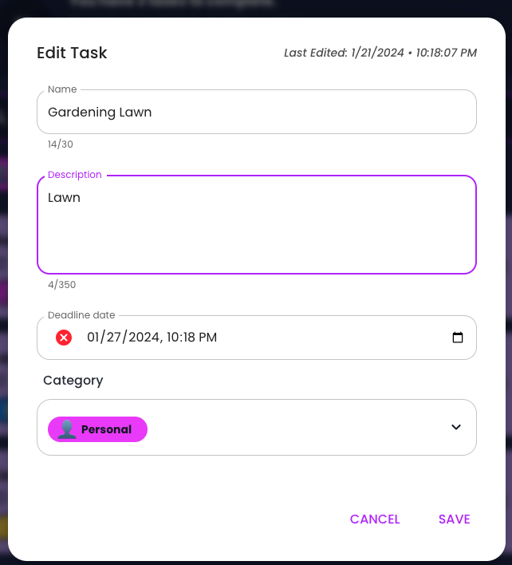
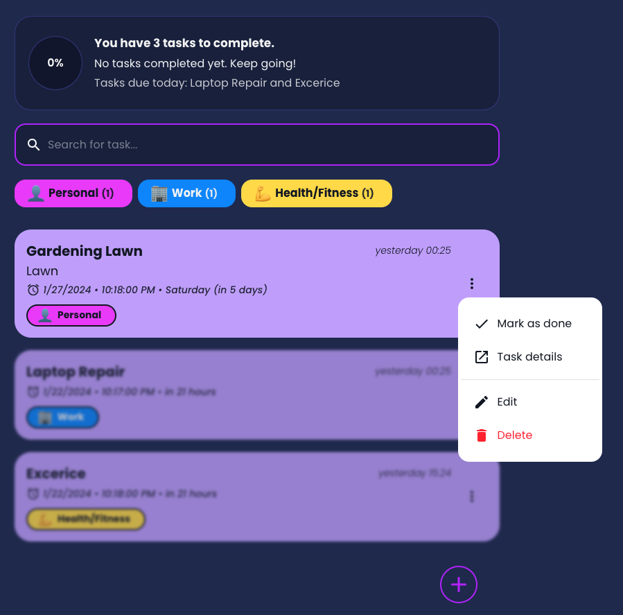
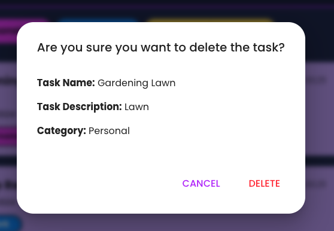
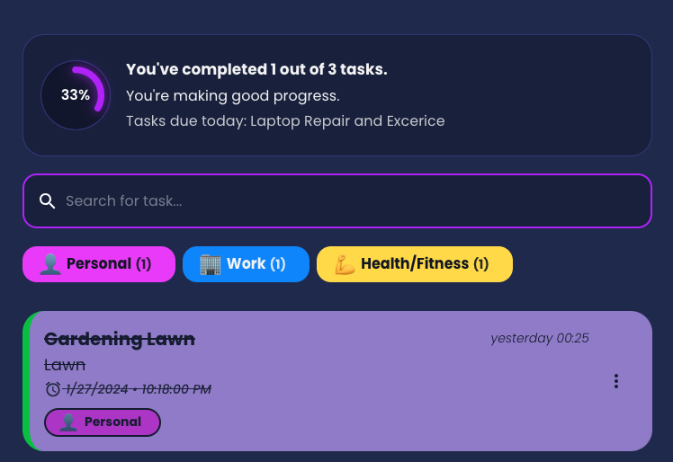
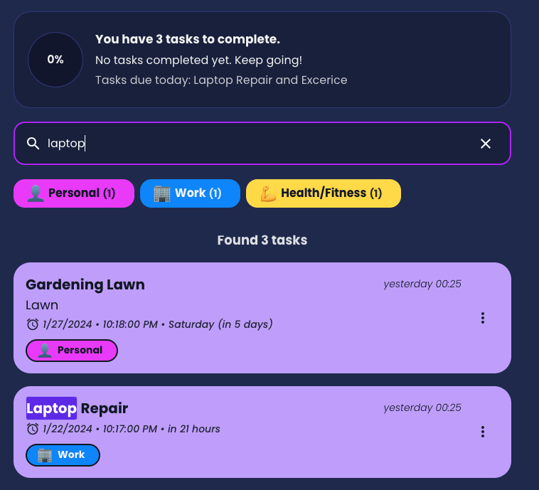
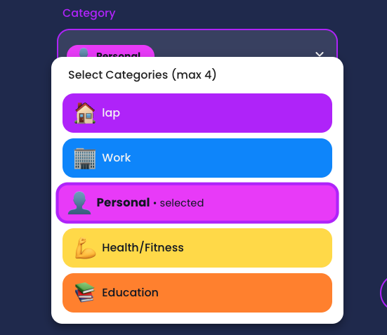

# Todo List

Todo list web app built with [ASP.NET Core](https://docs.microsoft.com/en-us/aspnet/core/?view=aspnetcore-3.1),
[ReactJS](https://reactjs.org/) and [SQL Server](https://www.microsoft.com/en-us/sql-server)

<table>
    <tbody>
        <tr>
            <td></td>
            <td rowspan=2></td>
        </tr>
        <tr>
            <td></td>
        </tr>
    </tbody>
</table>

## Technologies

-   Backend
    -   [ASP NET Core](https://docs.microsoft.com/en-us/aspnet/core/?view=aspnetcore-3.1)
    -   Entity Framework Core
    -   [SQL Server](https://www.microsoft.com/en-us/sql-server): Microsoft Relational Database
    -    ORM

-   Frontend
    -   [ReactJS](https://reactjs.org/)
-   [Docker](https://www.docker.com/)

## Features

- Create, Read, Update, and Delete operations for tasks.
- React frontend with a user-friendly interface.
- .NET backend API.
- MS SQL database integration.

## Approach

### Frontend Architecture

The frontend of this application uses a component-based architecture, to enhance reusability and separation of concerns. Key functionalities are embedded within dedicated components:

- `AddTaskBtn.tsx`: A button component to trigger the task addition flow.
- `CategorySelect.tsx`: Dropdown component for selecting task categories.
- `EditTask.tsx`: An interface for editing the details of tasks.
- `TaskMenu.tsx`: A context menu providing options to delete tasks or mark them as completed.
- `Tasks.tsx`: The main component that aggregates and displays the list of tasks.

This modular approach allows for scalable and maintainable code structure. 
For state management, We used React hooks to encapsulate local state and side effects, providing a clean and efficient way to handle the application's dynamic data.

### Page Components

The application has specific pages corresponding to major features, to improve user experience through clear navigation:

- `AddTask.tsx`: A page dedicated to creating new tasks, with form inputs to capture all necessary task information.
- `Categories.tsx`: This page allows users to manage their task categories, helping in the organization and filtering of tasks.
- `TaskDetails.tsx`: A detailed view for each task, offering an in-depth look at the task's properties and the ability to modify them.

### Backend Communication

The `services` directory contains all the methods required to interact with the backend, encapsulating the API logic:

- `createTodo`: POST request to `baseUrl/v1/todolist/items` to add a new task.
- `getTodos`: GET request to `baseUrl/v1/todolist/items` to retrieve all tasks.
- `updateTodo`: PUT request to `baseUrl/v1/todolist/items/{id}` to update an existing task.
- `deleteTodo`: DELETE request to `baseUrl/v1/todolist/items/{id}` to remove a task.

By abstracting these operations into service methods, the components remain clean and focused on the UI logic, delegating data operations to the service layer. 
The `todoService` provides a straightforward API for the components to interact with the backend, streamlining the process of sending and receiving data to and from the server.

## Features Implemented

- Create, Read, Update and Delete the tasks.
- Real-time search functionality to quickly find tasks as the user types.
- Percentage completion based on the number of tasks completed.
- Added Catogories to easily idenfify the priority ones.

## Front End Features:

Adding a task: 

Updating a task:

Editing a task:

Deleting a task:

Percentage completion:

Searching for a task:

Catogories:

