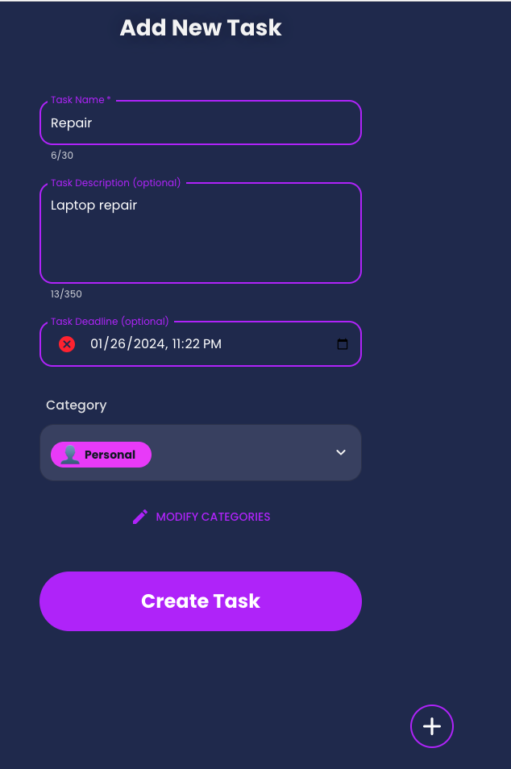

# Todo List

Todo list web app built with [ASP.NET Core](https://docs.microsoft.com/en-us/aspnet/core/?view=aspnetcore-3.1),
[ReactJS](https://reactjs.org/) and [SQL Server](https://www.microsoft.com/en-us/sql-server)

<table>
    <tbody>
        <tr>
            <td></td>
            <td rowspan=2></td>
        </tr>
        <tr>
            <td></td>
        </tr>
    </tbody>
</table>

## Technologies

-   Backend
    -   [ASP NET Core](https://docs.microsoft.com/en-us/aspnet/core/?view=aspnetcore-3.1)
    -   Entity Framework Core
    -   [SQL Server](https://www.microsoft.com/en-us/sql-server): Microsoft Relational Database
    -    ORM

-   Frontend
    -   [ReactJS](https://reactjs.org/)
-   [Docker](https://www.docker.com/)

## Features

- Create, Read, Update, and Delete operations for tasks.
- React frontend with a user-friendly interface.
- .NET backend API.
- MS SQL database integration.

## Approach

Front end 

## Front End Features:

Adding a task: 

